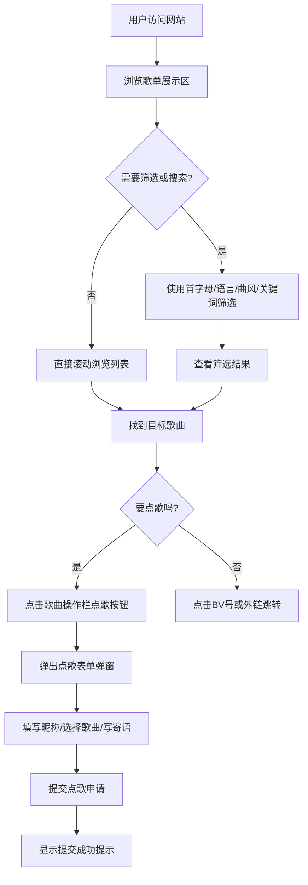

## 1. 产品概述

"Dasy独狼"是一个为虚拟主播/视频博主粉丝打造的在线点歌平台，提供美观的歌单浏览、多维度筛选搜索和便捷的点歌体验。
- 目标用户：主播粉丝及直播间观众，通过简单操作即可浏览歌单并提交点歌请求
- 产品价值：为主播提供专业的点歌台展示，为粉丝提供沉浸式的点歌互动体验

## 2. 核心功能

### 2.1 用户角色
| 角色 | 访问方式 | 核心权限 |
|------|----------|----------|
| 粉丝用户 | 直接访问网站 | 浏览歌单、筛选搜索、提交点歌、查看歌曲链接 |

### 2.2 功能模块
1. **首页（歌单页）**：主播形象展示区、快捷导航、筛选栏、搜索框、歌曲列表、随便听听
2. **点歌表单弹窗**：填写昵称、选择歌曲、提交寄语
3. **歌单管理（前端展示层面）**：歌曲表格展示、状态标识

### 2.3 页面详情
| 页面名称 | 模块名称 | 功能描述 |
|----------|----------|----------|
| 首页 | Hero形象区 | 主播头像+名称展示、风格标签说明、快捷跳转按钮（个人空间/直播间） |
| 首页 | 筛选工具栏 | 首字母筛选下拉、语言筛选下拉、曲风筛选下拉、条件筛选下拉 |
| 首页 | 搜索功能 | 关键词搜索歌曲名/歌手名、清空搜索 |
| 首页 | 随便听听 | 随机推荐一首歌并高亮展示 |
| 首页 | 歌曲列表表格 | 展示歌名、歌手、语言、曲风、付费状态、歌切标识、备注、操作按钮 |
| 首页 | 点歌弹窗 | 输入昵称、选择歌曲、填写寄语、提交点歌申请 |
| 首页 | 页脚链接区 | B站视频快捷链接、底部版权及备案信息 |

## 3. 核心流程

粉丝访问网站 → 浏览/筛选/搜索歌单 → 找到心仪歌曲 → 点击点歌按钮 → 填写点歌表单 → 提交成功提示

## 4. 用户界面设计

### 4.1 设计风格
- **主色调**：深邃紫黑渐变背景（#0f0b1e → #1a1033），搭配冷蓝色（#4f8cff）和紫罗兰（#8b5cf6）点缀，营造「独狼」冷峻而高贵的夜间氛围
- **辅助色**：狼瞳金色（#fbbf24）作为高亮强调色，用于重要按钮和状态标识
- **按钮风格**：圆角胶囊形（rounded-full），玻璃拟态（glassmorphism）半透明背景，hover时有渐变发光效果
- **字体选择**：标题使用「ZCOOL KuaiLe / 站酷快乐体」展现个性，正文使用「Noto Sans SC」保证可读性
- **布局风格**：卡片式布局 + 毛玻璃效果容器，背景主视觉使用狼+月夜主题插画
- **图标/emoji风格**：Lucide图标库，统一线性风格，搭配🐺🌙🎵等狼与音乐主题emoji

### 4.2 页面设计概述
| 页面名称 | 模块名称 | UI元素 |
|----------|----------|--------|
| 首页 | Hero形象区 | 居中圆形主播头像（发光紫色边框+呼吸动画）、大标题艺术字体、副标题擅长曲风标签、胶囊形快捷跳转按钮组 |
| 首页 | 筛选工具栏 | 横向排列半透明圆角下拉框 + 搜索框 + 胶囊按钮，间距均匀，选中项有金色高亮边框 |
| 首页 | 歌曲列表表格 | 毛玻璃卡片容器、斑马纹行、表头悬浮固定、hover行背景微亮、状态标签（付费/免费/歌切）用不同颜色区分 |
| 首页 | 点歌弹窗 | 居中对话框、背景模糊遮罩、分步表单、输入框带图标、提交按钮金色渐变 |
| 首页 | 页脚 | 横向BV号链接卡片、底部版权文字居中 |

### 4.3 响应式
- 桌面优先设计（1280px+基准）
- 平板端（768px-1279px）：筛选栏两排布局、表格可横向滚动
- 移动端（<768px）：筛选栏纵向堆叠、歌曲列表转为卡片式单列展示、头像和标题居中缩放
- 所有触摸按钮最小尺寸 44px×44px

### 4.4 动效指引
- 页面加载：头像旋转淡入 → 标题逐字浮现 → 筛选栏下滑入场（stagger动画）
- 悬停效果：按钮发光扩散、表格行轻微上浮+阴影加深
- 点歌弹窗：缩放淡入 + 背景模糊过渡
- 随便听听按钮：点击时波纹扩散效果 + 随机选中行闪烁高亮
- 背景：微弱的星点粒子漂浮动画，营造月夜氛围
