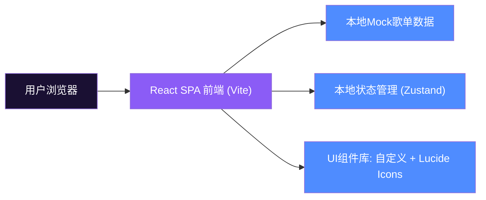
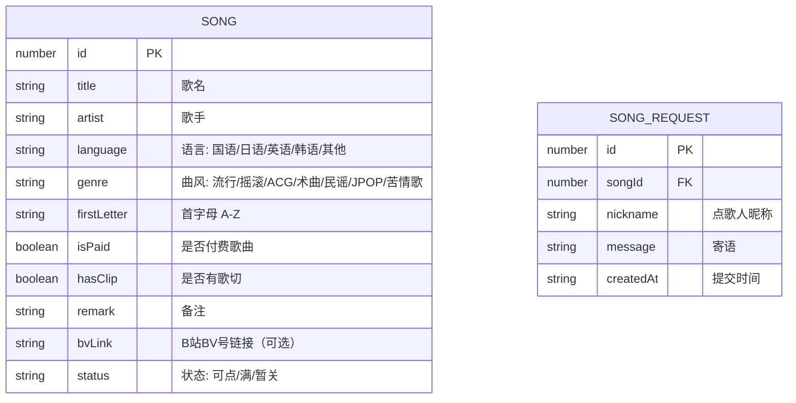

## 1. 架构设计



## 2. 技术描述
- **前端**：React@18 + TypeScript + Vite@5 + TailwindCSS@3
- **状态管理**：Zustand（存储筛选条件、点歌弹窗状态、点歌提交记录）
- **路由**：react-router-dom（单页应用，首页为 / 主路由）
- **图标**：lucide-react（统一线性风格图标）
- **数据层**：纯前端 Mock 数据（src/data/songs.ts），不依赖后端服务
- **字体**：Google Fonts CDN 引入 ZCOOL KuaiLe + Noto Sans SC

## 3. 路由定义
| 路由 | 用途 |
|------|------|
| / | 首页：主播形象展示 + 歌单列表 + 筛选搜索 + 点歌弹窗 |

## 4. 数据模型
### 4.1 数据模型定义



### 4.2 Mock数据示例
```typescript
// src/data/songs.ts
export interface Song {
  id: number;
  title: string;
  artist: string;
  language: '国语' | '日语' | '英语' | '韩语' | '其他';
  genre: string;
  firstLetter: string;
  isPaid: boolean;
  hasClip: boolean;
  remark: string;
  bvLink?: string;
  status: 'available' | 'full' | 'closed';
}

export const songs: Song[] = [
  {
    id: 1,
    title: '阿司匹林',
    artist: '王以太',
    language: '国语',
    genre: '流行',
    firstLetter: 'A',
    isPaid: false,
    hasClip: false,
    remark: '-',
    status: 'available'
  },
  // ... 更多歌曲数据
];
```

## 5. 项目目录结构
```
点歌/
├── .trae/documents/           # 项目文档
├── public/                     # 静态资源
│   └── favicon.ico
├── src/
│   ├── components/             # 可复用组件
│   │   ├── AvatarHero.tsx      # 主播头像Hero区
│   │   ├── FilterBar.tsx       # 筛选工具栏
│   │   ├── SearchBox.tsx       # 搜索框
│   │   ├── SongTable.tsx       # 歌曲列表表格
│   │   ├── SongCard.tsx        # 移动端歌曲卡片
│   │   ├── RequestModal.tsx    # 点歌表单弹窗
│   │   ├── FooterLinks.tsx     # 页脚BV链接
│   │   └── StarBackground.tsx  # 星空粒子背景
│   ├── data/
│   │   └── songs.ts            # Mock歌单数据
│   ├── hooks/
│   │   └── useSongFilter.ts    # 筛选搜索逻辑Hook
│   ├── pages/
│   │   └── Home.tsx            # 首页主组件
│   ├── store/
│   │   └── useSongStore.ts     # Zustand状态管理
│   ├── types/
│   │   └── index.ts            # 类型定义
│   ├── App.tsx
│   ├── main.tsx
│   └── index.css               # Tailwind样式 + 全局自定义
├── index.html
├── package.json
├── vite.config.ts
├── tsconfig.json
├── tailwind.config.js
└── postcss.config.js
```

## 6. 状态管理设计（Zustand Store）
```typescript
interface SongState {
  // 筛选条件
  firstLetter: string;
  language: string;
  genre: string;
  condition: string;  // 全部 / 可点 / 免费 / 有歌切
  searchKeyword: string;
  // 弹窗
  isRequestModalOpen: boolean;
  selectedSong: Song | null;
  // 点歌记录
  requestHistory: SongRequest[];
  // 高亮行
  highlightedSongId: number | null;
  // Actions
  setFilter: (key, value) => void;
  resetFilters: () => void;
  openRequestModal: (song: Song) => void;
  closeRequestModal: () => void;
  submitRequest: (data) => void;
  playRandom: () => void;
}
```
